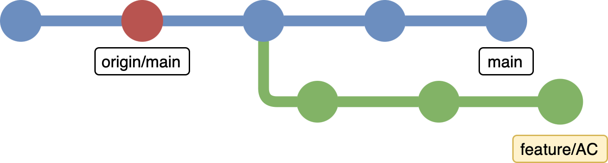

# 🎄 Git Distribute Commits

A git command to distribute the date of local (e.g. unpushed) git commits such
that they best fill your GitHub contribution graph.

Take the following git graph as an example, where the branch `feature/AC` is
currently checked out and the last commit, that was pushed to origin is the one
marked in red. Running `git distribute-commits` will alter the date of all
commits that are exclusive to the checked out branch and are a descendent of
the node that was pushed last to origin. That yields all the green nodes.

## Installation
Just download [git-distribute-commits](git-distribute-commits) and place
it in any directory that is part of your `PATH` environment variable.

You will also need [GitHub CLI](https://cli.github.com) tool.

## Changelog
This project keeps a [changelog](CHANGELOG.md) that adheres to
[Keep a Changelog](https://keepachangelog.com/en/1.1.0/).
